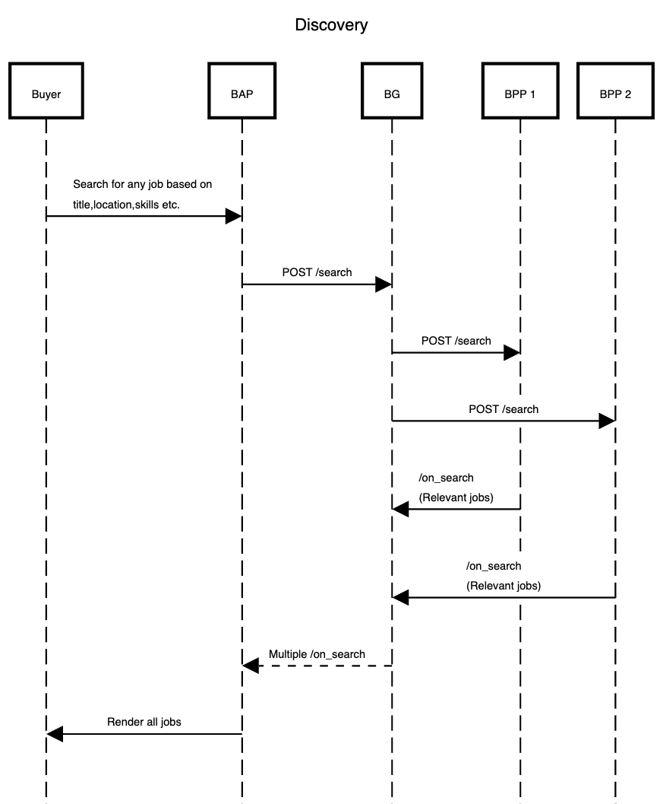
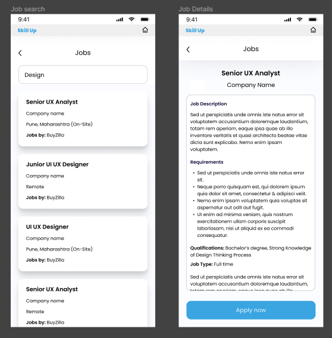
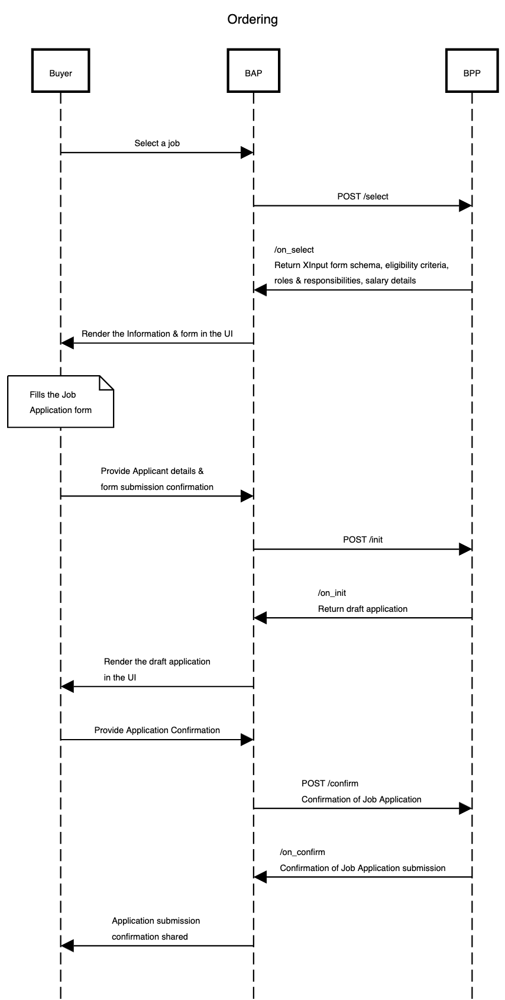
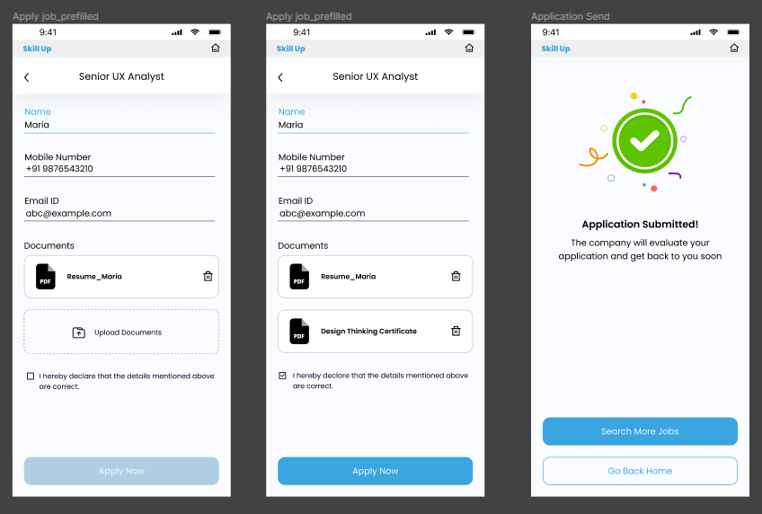
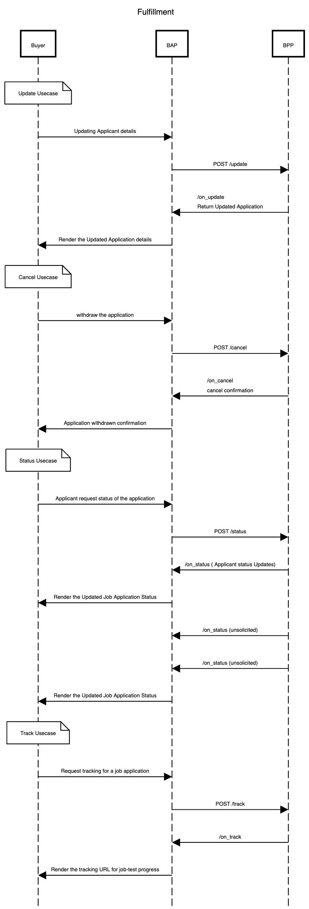
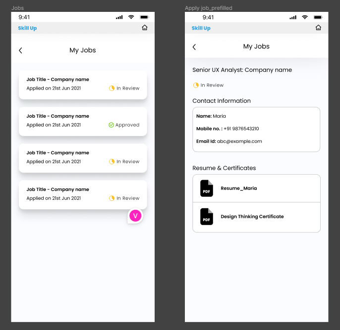
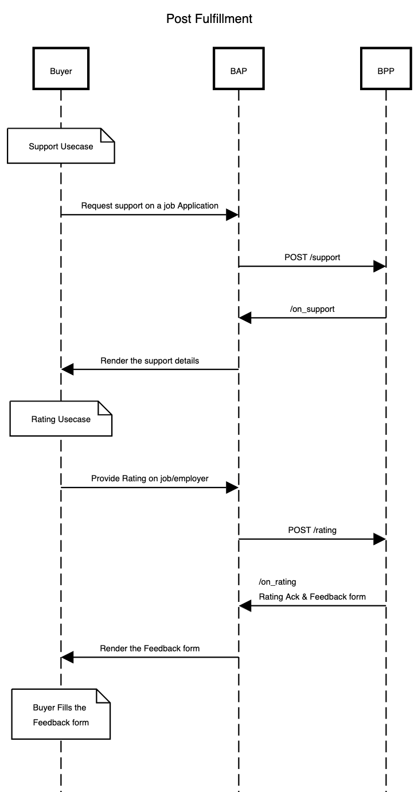

## Jobs Workflow #3
### Applying for Jobs Process Overview

Here we outline the workflow for discovering of jobs discovery and applying for the same using DSEP. The process involves interactions between the BAP app (Job Seeker) and the BPP (Jobs Provider) for job search, selection, and application. The typical workflow for jobs discovery comprises the following steps:

#### Step 1: BAP Initiates the Job Search
The BAP initiates a job search, which can be performed directly from the courses order details page or independently from the landing page/home screen.

#### Step 2: Provider Sends Jobs Lists
Upon receiving the search request, the provider responds by sending a list of available jobs. If there are no jobs currently available, the search results are empty. However, if jobs are available, the relevant searched results list is provided.

#### Step 3: BAP Selects a Job of Interest
The BAP reviews the list of available jobs and selects one of interest. At this point, the BAP can explore more details such as eligibility criteria and other relevant information before deciding to apply for the chosen job.

#### Step 4: BAP Completes the Required Form
Having selected a job, the BAP proceeds to complete the necessary forms, upload required documents, and submits the job application.

#### Step 5: Provider Receives the Job Application
Upon submission, the provider receives the job application. They undertake a review of the application and subsequently either offer the job position or reject the application.

#### Step 6: BAP Receives Notification
The BAP receives a notification regarding the status of the job offer. This notification indicates whether the job is in review, approved, or rejected. The status of the job changes accordingly. 

### Job Search and Select (Searching and Select for Jobs)
The user declares the intent for Data Analyst courses and makes a search. And the providers publish the catalog of their Jobs related to the searched keywords. 

#### User-side Actions
- The user declares the intent for searching for a Job. 

#### Provider-side Actions
- In this interaction, the Provider publishes their catalog of several Job that are available.  

#### Logical Workflow 


#### Figma


#### Example `search` request (based on Job Title)
```json
{
    "context": {
        "domain": "dsep:jobs",
        "action": "search",
        "version": "1.0.0",
        "bap_id": "dsep-protocol.becknprotocol.io",
        "bap_uri": "https://dsep-protocol-network.becknprotocol.io/",
        "transaction_id": "a9aaecca-10b7-4d19-b640-b047a7c62195",
         "message_id": "$89bdae17-9942-40c8-869a-5bd413356407",
        "timestamp": "2022-10-11T09:55:41.161Z",
        "ttl": "PT30S"
    },
    "message": {
        "intent": {
            "item": 
                {
                    "descriptor": {
                        "name": "Engineer"
                    }
                }
            
        }
    }
}
```
#### Example `search` request (based on Job Code and Title)
```json
{
    "context": {
        "domain": "dsep:jobs",
        "action": "search",
        "version": "1.0.0",
        "bap_id": "dsep-protocol.becknprotocol.io",
        "bap_uri": "https://dsep-protocol-network.becknprotocol.io/",
        "transaction_id": "a9aaecca-10b7-4d19-b640-b047a7c62195",
         "message_id": "$89bdae17-9942-40c8-869a-5bd413356407",
        "timestamp": "2022-10-11T09:55:41.161Z",
        "ttl": "PT30S"
    },
    "message": {
        "intent": {
            "item": 
                {
                    "descriptor": {
                        "code": "SE2023-123",
                        "name": "Software engineer"
                    }
                }

        }
    }
}
```
#### Example `search` request (based on Job Provider)
```json
{
    "context": {
          "domain": "dsep:jobs",
        "action": "search",
        "version": "1.0.0",
        "bap_id": "dsep-protocol.becknprotocol.io",
        "bap_uri": "https://dsep-protocol-network.becknprotocol.io/",
        "transaction_id": "a9aaecca-10b7-4d19-b640-b047a7c62195",
        "message_id": "$89bdae17-9942-40c8-869a-5bd413356407",
        "timestamp": "2022-10-11T09:55:41.161Z",
        "ttl": "PT30S"
    },
    "message": {
        "intent": {
            "provider": 
                {
                    "descriptor": {
                        "name": "Google"
                    }
                }
        }
    }
}
```
#### Example `search` request (based on Job Title and Provider Location)
```json
{
    "context": {
        "domain": "dsep:jobs",
        "action": "search",
        "version": "1.0.0",
        "bap_id": "dsep-protocol.becknprotocol.io",
        "bap_uri": "https://dsep-protocol-network.becknprotocol.io/",
        "transaction_id": "a9aaecca-10b7-4d19-b640-b047a7c62195",
        "message_id": "$89bdae17-9942-40c8-869a-5bd413356407",
        "timestamp": "2022-10-11T09:55:41.161Z",
        "ttl": "PT30S"
    },
    "message": {
        "intent": {
            "item": {
                "descriptor": {
                    "name": "Engineer"
                }
            },
            "provider": {
                "descriptor": {
                    "name": "Affinidi"
                },
                "locations": [
                    {
                        "city": {
                            "name": "Bangalore"
                        }
                    }
                ]
            }
        }
    }
}
```
#### Example `search` request (based on Provider and Location)
```json
{
    "context": {
        "domain": "dsep:jobs",
        "action": "search",
        "version": "1.0.0",
        "bap_id": "dsep-protocol.becknprotocol.io",
        "bap_uri": "https://dsep-protocol-network.becknprotocol.io/",
        "transaction_id": "a9aaecca-10b7-4d19-b640-b047a7c62195",
        "message_id": "$89bdae17-9942-40c8-869a-5bd413356407",
        "timestamp": "2022-10-11T09:55:41.161Z",
        "ttl": "PT30S"
    },
    "message": {
        "intent": {
            "provider": {
                "descriptor": {
                    "name": "Affinidi"
                },
                "locations": [
                    {
                        "city": {
                            "name": "Bangalore",
                            "code" : "std:080"
                        }
                    }
                ]
            }
        }
    }
}
```
#### Example `search` request (based on Provider and Multiple Location)
```json
{
    "context": {
          "domain": "dsep:jobs",
        "action": "search",
        "version": "1.0.0",
        "bap_id": "dsep-protocol.becknprotocol.io",
        "bap_uri": "https://dsep-protocol-network.becknprotocol.io/",
        "transaction_id": "a9aaecca-10b7-4d19-b640-b047a7c62195",
        "message_id": "$89bdae17-9942-40c8-869a-5bd413356407",
        "timestamp": "2022-10-11T09:55:41.161Z",
        "ttl": "PT30S"
    },
    "message": {
        "intent": {
            "provider": {
                "descriptor": {
                    "name": "Affinidi"
                },
                "locations": [
                    {
                        "city": {
                            "name": "Pune",
                            "code" : "std:020"
                        }
                    },
                    {
                        "city": {
                            "name": "Bangalore",
                            "code" : "std:080"
                        }
                    }
                ]
            }
        }
    }
}
```
#### Example `search` request (based on Skills)
```json
{
    "context": {
        "domain": "dsep:jobs",
        "action": "search",
        "version": "1.0.0",
        "bap_id": "dsep-protocol.becknprotocol.io",
        "bap_uri": "https://dsep-protocol-network.becknprotocol.io/",
        "transaction_id": "a9aaecca-10b7-4d19-b640-b047a7c62195",
         "message_id": "$89bdae17-9942-40c8-869a-5bd413356407",
        "timestamp": "2022-10-11T09:55:41.161Z",
        "ttl": "PT30S"
    },
    "message": {
        "intent": {
            "item": [
                {
                    "tags": [
                        {
                            "code": "req-skills",
                            "list": [
                                {
                                    "code": "flutter"
                                },
                                {
                                    "code": "kotlin"
                                },
                                {
                                    "code": "architecture"
                                }
                            ]
                        }
                    ]
                }
            ]
        }
    }
}
```
#### Example `search` request (based only on Provider Location)
```json
{
    "context": {
        "domain": "dsep:jobs",
        "action": "search",
        "version": "1.0.0",
        "bap_id": "dsep-protocol.becknprotocol.io",
        "bap_uri": "https://dsep-protocol-network.becknprotocol.io/",
        "transaction_id": "a9aaecca-10b7-4d19-b640-b047a7c62195",
        "message_id": "$89bdae17-9942-40c8-869a-5bd413356407",
        "timestamp": "2022-10-11T09:55:41.161Z",
        "ttl": "PT30S"
    },
    "message": {
        "intent": {
            "provider": {
                "locations": [
                    {
                        "city": {
                            "name": "Pune",
                            "code" : "std:020"
                        }
                    },
                    {
                        "city": {
                            "name": "Delhi",
                            "code" : "std:011"
                        }
                    }
                ]
            }
        }
    }
}
```

#### Example `on_search` request
```json
{
    "context": {
        "domain": "dsep:jobs",
        "location": {
            "country": {
                "name": "India",
                "code": "IND"
            }
        },
        "action": "on_search",
        "version": "1.0.0",
        "bap_id": "dsep-protocol.becknprotocol.io",
        "bap_uri": "https://dsep-protocol-network.becknprotocol.io/",
        "bpp_id": "affinidi.com.bpp",
        "bpp_uri": "https://6vs8xnx5i7.execute-api.ap-south-1.amazonaws.com/dsep",
        "transaction_id": "a9aaecca-10b7-4d19-b640-b047a7c62195",
        "message_id": "672f774c-4281-44dd-b1c2-84222a3d771e",
        "timestamp": "2023-02-22T11:45:10.1712958+00:00",
        "ttl": "P1M"
    },
    "message": {
        "catalog": {
            "descriptor": {
                "name": "Affindi Jobs"
            },
            "payments": [],
            "providers": [
                {
                    "id": "1",
                    "descriptor": {
                        "name": "Affinidi"
                    },
                    "locations": [
                        {
                            "id": "1",
                            "city": {
                                "name": "Bangalore"
                            },
                            "state": {
                                "name": ""
                            },
                            "country": {
                                "name": ""
                            }
                        },
                        {
                            "id": "2",
                            "city": {
                                "name": "Bangalore"
                            },
                            "state": {
                                "name": ""
                            },
                            "country": {
                                "name": ""
                            }
                        }
                    ],
                    "items": [
                        {
                            "id": "D7F8606A370DA9966DF15E62A81C374B",
                            "descriptor": {
                                "name": "Database Engineer",
                                "long_desc": "We’re on a search for a Staff Mobile Developer with the following attributes: Critical Thinking- You are able to skillfully conceptualise, apply, analyse and evaluate information gathered from observation, experience or communication and use it as a guide to action Data-Driven attitude — You often propose solutions or make a point in a logical and objective manner, substantiated with accurate data and evidence Dealing with Ambiguity — You can effectively cope with change and uncertainty, and are comfortable when things are up in the air Goal-oriented — You are driven and can be counted on to exceed goals. You steadfastly push yourself and others to achieve results all the time Problem Solving — You can easily identify and solve complex problems in a methodological manner "
                            },
                            "location_ids": [
                                "1"
                            ]
                        },
                        {
                            "id": "0253719F295521CED39EC9C2F3C8DCDE",
                            "descriptor": {
                                "name": "Fullstack Engineer",
                                "long_desc": "We’re on a search for a Staff Mobile Developer with the following attributes: Critical Thinking- You are able to skillfully conceptualise, apply, analyse and evaluate information gathered from observation, experience or communication and use it as a guide to action Data-Driven attitude — You often propose solutions or make a point in a logical and objective manner, substantiated with accurate data and evidence Dealing with Ambiguity — You can effectively cope with change and uncertainty, and are comfortable when things are up in the air Goal-oriented — You are driven and can be counted on to exceed goals. You steadfastly push yourself and others to achieve results all the time Problem Solving — You can easily identify and solve complex problems in a methodological manner "
                            },
                            "location_ids": [
                                "2"
                            ]
                        }
                    ]
                },
                {
                    "id": "1",
                    "descriptor": {
                        "name": "Affinidi"
                    },
                    "locations": [
                        {
                            "id": "1",
                            "city": {
                                "name": "Bangalore"
                            },
                            "state": {
                                "name": ""
                            },
                            "country": {
                                "name": ""
                            }
                        },
                        {
                            "id": "2",
                            "city": {
                                "name": "Bangalore"
                            },
                            "state": {
                                "name": ""
                            },
                            "country": {
                                "name": ""
                            }
                        }
                    ],
                    "items": [
                        {
                            "id": "D7F8606A370DA9966DF15E62A81C374B",
                            "descriptor": {
                                "name": "Database Engineer",
                                "long_desc": "We’re on a search for a Staff Mobile Developer with the following attributes: Critical Thinking- You are able to skillfully conceptualise, apply, analyse and evaluate information gathered from observation, experience or communication and use it as a guide to action Data-Driven attitude — You often propose solutions or make a point in a logical and objective manner, substantiated with accurate data and evidence Dealing with Ambiguity — You can effectively cope with change and uncertainty, and are comfortable when things are up in the air Goal-oriented — You are driven and can be counted on to exceed goals. You steadfastly push yourself and others to achieve results all the time Problem Solving — You can easily identify and solve complex problems in a methodological manner "
                            },
                            "location_ids": [
                                "1"
                            ]
                        },
                        {
                            "id": "0253719F295521CED39EC9C2F3C8DCDE",
                            "descriptor": {
                                "name": "Fullstack Engineer",
                                "long_desc": "We’re on a search for a Staff Mobile Developer with the following attributes: Critical Thinking- You are able to skillfully conceptualise, apply, analyse and evaluate information gathered from observation, experience or communication and use it as a guide to action Data-Driven attitude — You often propose solutions or make a point in a logical and objective manner, substantiated with accurate data and evidence Dealing with Ambiguity — You can effectively cope with change and uncertainty, and are comfortable when things are up in the air Goal-oriented — You are driven and can be counted on to exceed goals. You steadfastly push yourself and others to achieve results all the time Problem Solving — You can easily identify and solve complex problems in a methodological manner "
                            },
                            "location_ids": [
                                "2"
                            ]
                        }
                    ]
                }
            ]
        }
    }
}
```

### Job Selecting, Ordering and Confirmation of Applying 
#### User-side Actions
- The user chooses the Job Posting (select) that they wish to apply for.
- The user fills the form and submits (orders) the job application. 
- The Job application confirmation is shared to the user. 
#### Provider-side Actions
- The Provider then pushes the information to collect like role and responsibility details, salary, eligibility criteria. 
- The Provider pushes the draft application to renders with the BAP. 
- The Provider confirms the job application is received. 
#### Logical Workflow 

#### Figma


#### Example `select` request
```json
{
    "context": {
        "domain": "dsep:jobs",
        "location": {
            "country": {
                "name": "India",
                "code": "IND"
            }
        },
        "action": "select",
        "version": "1.0.0",
        "bap_id": "dsep-protocol.becknprotocol.io",
        "bap_uri": "https://dsep-protocol-network.becknprotocol.io/",
        "bpp_id": "affinidi.com.bpp",
        "bpp_uri": "https://6vs8xnx5i7.execute-api.ap-south-1.amazonaws.com/dsep",
        "transaction_id": "a9aaecca-10b7-4d19-b640-b047a7c62195",
        "message_id": "$89bdae17-9942-40c8-869a-5bd413356407",
        "timestamp": "2023-02-14T12:11:46.1295616+00:00",
        "ttl": "P1M"
    },
    "message": {
        "order": {
            "provider":{
                "id":"1"
            },
            "items": [
                {
                    "id": "a23f2fdfbbb8ac402bf259d75402eb0792f50c095f7d08a55475e7af1c2dadca"
                }
            ]
        }
    }
}
```
#### Example `on_select` request

```json
{
    "context": {
        "domain": "dsep:jobs",
        "version": "1.0.0",
        "action": "select",
        "bap_id": "dsep-protocol.becknprotocol.io",
        "bap_uri": "https://dsep-protocol-network.becknprotocol.io/",
        "bpp_id": "affinidi.com.bpp",
        "bpp_uri": "https://6vs8xnx5i7.execute-api.ap-south-1.amazonaws.com/dsep",
        "transaction_id": "a9aaecca-10b7-4d19-b640-b047a7c62195",
        "message_id": "c8e3968c-cd78-4e46-aa34-0d541e46bd73",
        "ttl": "PT10M",
        "timestamp": "2023-02-22T11:50:46.742Z"
    },
    "responses": [
        {
            "context": {
                "domain": "dsep:jobs",
                "location": {
                    "country": {
                        "name": "India",
                        "code": "IND"
                    }
                },
                "action": "on_select",
                "version": "1.0.0",
                "bap_id": "dsep-protocol.becknprotocol.io",
                "bap_uri": "https://dsep-protocol-network.becknprotocol.io/",
                "bpp_id": "affinidi.com.bpp",
                "bpp_uri": "https://6vs8xnx5i7.execute-api.ap-south-1.amazonaws.com/dsep",
                "transaction_id": "a9aaecca-10b7-4d19-b640-b047a7c62195",
                "message_id": "c8e3968c-cd78-4e46-aa34-0d541e46bd73",
                "timestamp": "2023-02-22T11:50:47.0702701+00:00",
                "ttl": "P1M"
            },
            "message": {
                "order": {
                    "provider": {
                        "descriptor": {
                            "name": "Affinidi"
                        },
                        "fulfillments": [
                            {
                                "id": "1",
                                "type": "remote",
                                "tracking": false
                            },
                            {
                                "id": "2",
                                "type": "hybrid",
                                "tracking": false
                            },
                            {
                                "id": "3",
                                "type": "Onsite",
                                "tracking": false
                            }
                        ],
                        "locations": [
                            {
                                "id": "1",
                                "city": {
                                    "name": "Bangalore"
                                }
                            }
                        ]
                    },
                    "items": [
                        {
                            "id": "0253719F295521CED39EC9C2F3C8DCDE",
                            "descriptor": {
                                "name": "Fullstack Engineer",
                                "long_desc": "We’re on a search for a Staff Mobile Developer with the following attributes: Critical Thinking- You are able to skillfully conceptualise, apply, analyse and evaluate information gathered from observation, experience or communication and use it as a guide to action Data-Driven attitude — You often propose solutions or make a point in a logical and objective manner, substantiated with accurate data and evidence Dealing with Ambiguity — You can effectively cope with change and uncertainty, and are comfortable when things are up in the air Goal-oriented — You are driven and can be counted on to exceed goals. You steadfastly push yourself and others to achieve results all the time Problem Solving — You can easily identify and solve complex problems in a methodological manner "
                            },
                            "category_ids": [
                                "1",
                                "2"
                            ],
                            "fulfillment_ids": [
                                "1",
                                "2",
                                "3"
                            ],
                            "location_ids": [
                                "1"
                            ],
                            "xinput": {
                                "form": {
                                    "url": "https://6vs8xnx5i7.execute-api.ap-south-1.amazonaws.com/dsep/xinput/formid/0253719F295521CED39EC9C2F3C8DCDE"
                                }
                            },
                            "time": {
                                "range": {
                                    "start": "2023-01-03T13:23:01+00:00",
                                    "end": "2023-02-03T13:23:01+00:00"
                                }
                            },
                            "tags": [
                                {
                                    "descriptor": {
                                        "name": "Minimum Educational Qualifications"
                                    },
                                    "list": [
                                        {
                                            "descriptor": {
                                                "name": "degree",
                                                "code": "degree"
                                            },
                                            "value": "Bachelors"
                                        },
                                        {
                                            "descriptor": {},
                                            "value": "Bachelors or Equivalent Practical Experience"
                                        }
                                    ],
                                    "display": true
                                },
                                {
                                    "descriptor": {
                                        "name": "Preferred Educational Qualifications"
                                    },
                                    "list": [
                                        {
                                            "descriptor": {
                                                "name": "degree",
                                                "code": "degree"
                                            },
                                            "value": "Masters"
                                        },
                                        {
                                            "descriptor": {
                                                "name": "degree",
                                                "code": "degree"
                                            },
                                            "value": "PhD"
                                        },
                                        {
                                            "descriptor": {},
                                            "value": "Master's degree or PhD in Computer Science or related technical field."
                                        }
                                    ],
                                    "display": true
                                },
                                {
                                    "descriptor": {
                                        "name": "Work Experience"
                                    },
                                    "list": [
                                        {
                                            "descriptor": {
                                                "name": "Software Development Experienceegree",
                                                "code": "Software Development Experienceegree"
                                            },
                                            "value": "3 years"
                                        },
                                        {
                                            "descriptor": {},
                                            "value": "2 years of Technical Leadership Experience"
                                        },
                                        {
                                            "descriptor": {},
                                            "value": "3 years of experience working in a complex, matrixed organization"
                                        }
                                    ],
                                    "display": true
                                },
                                {
                                    "descriptor": {
                                        "name": "Responsibilities"
                                    },
                                    "list": [
                                        {
                                            "value": "Build frontend experiences for our tools (Web, PWA and React Native) "
                                        },
                                        {
                                            "value": "Articulate a long term technical direction and vision for building, maintaining, and scaling our web and mobile platforms"
                                        },
                                        {
                                            "value": "Create trustworthy user experiences by building interfaces that are simple, easy to comprehend, performant and reliable using modern tools like React, React Native, Typescript, Node.js, Jest and Webpack."
                                        },
                                        {
                                            "value": "Mentor and train other team members on design techniques and coding standards. "
                                        },
                                        {
                                            "value": "Own all aspects of our front-end architecture "
                                        },
                                        {
                                            "value": "Contribute to process improvements and build a high-performance engineering culture "
                                        }
                                    ],
                                    "display": true
                                },
                                {
                                    "descriptor": {
                                        "name": "Employment Information",
                                        "code": "employment-info"
                                    },
                                    "list": [
                                        {
                                            "descriptor": {
                                                "name": "Employment Duration Type",
                                                "code": "emp-duration-type"
                                            },
                                            "value": "FULL_TIME"
                                        },
                                        {
                                            "descriptor": {
                                                "name": "Employment Duration Type",
                                                "code": "emp-duration-type"
                                            },
                                            "value": ""
                                        }
                                    ],
                                    "display": true
                                },
                                {
                                    "descriptor": {
                                        "name": "skill requirement",
                                        "code": "Skills"
                                    },
                                    "list": [
                                        {
                                            "descriptor": {
                                                "code": "You have 8+ years of engineering experience, predominantly in shipping user-facing production features"
                                            }
                                        },
                                        {
                                            "descriptor": {
                                                "code": "You are an expert in React.js and React Native, ideally using TypeScript language extensions  "
                                            }
                                        },
                                        {
                                            "descriptor": {
                                                "code": "You have a good understanding of JavaScript Design Patterns "
                                            }
                                        },
                                        {
                                            "descriptor": {
                                                "code": "You have good experience writing front end test cases  "
                                            }
                                        },
                                        {
                                            "descriptor": {
                                                "code": "You’re familiar with current trends and best practices in front-end architecture, including performance, security and usability.  "
                                            }
                                        },
                                        {
                                            "descriptor": {
                                                "code": "You’re familiar with product and design lifecycles, and collaborating closely with designers, engineers, and product managers "
                                            }
                                        },
                                        {
                                            "descriptor": {
                                                "code": "You have experience with Test Driven Development and know when to apply it."
                                            }
                                        },
                                        {
                                            "descriptor": {
                                                "code": "You have experience working on AWS or other cloud stacks and Docker.  "
                                            }
                                        },
                                        {
                                            "descriptor": {
                                                "code": "You have experience building systems with high data protection requirements, anonymous data and data encryption. "
                                            }
                                        },
                                        {
                                            "descriptor": {
                                                "code": "You have experience with IaaC. "
                                            }
                                        },
                                        {
                                            "descriptor": {
                                                "code": "You have worked on building responsive UI using React Native. "
                                            }
                                        }
                                    ],
                                    "display": true
                                },
                                {
                                    "descriptor": {
                                        "name": "Salary Compensation",
                                        "code": "salary-info"
                                    },
                                    "list": [
                                        {
                                            "descriptor": {
                                                "name": "baseSalary"
                                            },
                                            "value": "60000"
                                        },
                                        {
                                            "descriptor": {
                                                "name": "variableSalary"
                                            },
                                            "value": "60000"
                                        },
                                        {
                                            "descriptor": {
                                                "name": "allowance"
                                            },
                                            "value": "60000"
                                        },
                                        {
                                            "descriptor": {
                                                "name": "commission"
                                            },
                                            "value": "60000"
                                        },
                                        {
                                            "descriptor": {
                                                "name": "overtime"
                                            },
                                            "value": "8"
                                        }
                                    ],
                                    "display": true
                                }
                            ]
                        }
                    ],
                    "type": "DEFAULT"
                }
            }
        }
    ]
}
```

#### Example `init` request
```json
{
    "context": {
        "domain": "dsep:jobs",
        "location": {
            "country": {
                "name": "India",
                "code": "IND"
            }
        },
        "action": "init",
        "version": "1.0.0",
        "bap_id": "dsep-protocol.becknprotocol.io",
        "bap_uri": "https://dsep-protocol-network.becknprotocol.io/",
        "bpp_id": "affinidi.com.bpp",
        "bpp_uri": "https://6vs8xnx5i7.execute-api.ap-south-1.amazonaws.com/dsep",
        "transaction_id": "a9aaecca-10b7-4d19-b640-b047a7c62195",
        "message_id": "$89bdae17-9942-40c8-869a-5bd413356407",
        "timestamp": "2023-02-14T12:11:46.1295616+00:00",
        "ttl": "P1M"
    },
    "message": {
        "order": {
              "provider":{
                "id":"1"
            },
            "items": [
                {
                    "id": "a23f2fdfbbb8ac402bf259d75402eb0792f50c095f7d08a55475e7af1c2dadca"
                }
            ],
            "fulfillments": [
                {
                    "id": "1",
                    "customer": {
                        "person": {
                            "name": "Sanjay",
                            "gender": "M",
                            "creds": [
                                {
                                    "id": "claimId:af7e0b1b5c4858eb",
                                    "type": "GenderData",
                                    "url": "https://cloud-wallet-api.prod.affinity-project.org/api/v1/share/b8a2c0cbc5a02da03d2aecb59094672a8e0b16a1c845456bd18678529d6901df?key=beda347c431e02319bd31c63e5f5f5f5e14939efdb6697ce4d93c87eade27c47"
                                },
                                {
                                    "id": "claimId:af7e0b1b5c4858eb",
                                    "type": "ResumeVC",
                                    "url": "https://cloud-wallet-api.prod.affinity-project.org/api/v1/share/b8a2c0cbc5a02da03d2aecb59094672a8e0b16a1c845456bd18678529d6901df?key=beda347c431e02319bd31c63e5f5f5f5e14939efdb6697ce4d93c87eade27c47"
                                }
                            ],
                            "tags": [
                                {
                                    "code": "func_skills",
                                    "list": [
                                        {
                                            "code": "Android"
                                        },
                                        {
                                            "code": "AWS"
                                        }
                                    ]
                                }
                            ]
                        },
                        "contact": {
                            "phone": "9999999999999",
                            "email": "abc@abc.bc"
                        }
                    }
                }
            ],
            "xinput": {
                "data": "",
                "submission_id": ""
            }
        }
    }
}
```
#### Example `on_init` request
```json
   {
            "context": {
                "domain": "dsep:jobs",
                "location": {
                    "country": {
                        "name": "India",
                        "code": "IND"
                    }
                },
                "action": "on_init",
                "version": "1.0.0",
                "bap_id": "dsep-protocol.becknprotocol.io",
                "bap_uri": "https://dsep-protocol-network.becknprotocol.io/",
                "bpp_id": "affinidi.com.bpp",
                "bpp_uri": "https://6vs8xnx5i7.execute-api.ap-south-1.amazonaws.com/dsep",
                "transaction_id": "a9aaecca-10b7-4d19-b640-b047a7c62195",
                "message_id": "af58aa7b-6745-47d0-9b0d-62dcb262ee87",
                "timestamp": "2023-02-23T10:14:05.5579055+00:00",
                "ttl": "P1M"
            },
            "message": {
                "order": {
                    "provider": {
                        "descriptor": {
                            "name": "Affinidi"
                        },
                        "fulfillments": [
                            {
                                "id": "1",
                                "type": "remote",
                                "tracking": false
                            },
                            {
                                "id": "2",
                                "type": "hybrid",
                                "tracking": false
                            },
                            {
                                "id": "3",
                                "type": "Onsite",
                                "tracking": false
                            }
                        ],
                        "locations": [
                            {
                                "id": "1",
                                "city": {
                                    "name": "Bangalore"
                                }
                            }
                        ]
                    },
                    "items": [
                        {
                            "id": "a23f2fdfbbb8ac402bf259d75402eb0792f50c095f7d08a55475e7af1c2dadca",
                            "descriptor": {
                                "name": "Support manager",
                                "long_desc": "We’re on a search for a Staff Mobile Developer with the following attributes: Critical Thinking- You are able to skillfully conceptualise, apply, analyse and evaluate information gathered from observation, experience or communication and use it as a guide to action Data-Driven attitude — You often propose solutions or make a point in a logical and objective manner, substantiated with accurate data and evidence Dealing with Ambiguity — You can effectively cope with change and uncertainty, and are comfortable when things are up in the air Goal-oriented — You are driven and can be counted on to exceed goals. You steadfastly push yourself and others to achieve results all the time Problem Solving — You can easily identify and solve complex problems in a methodological manner "
                            },
                            "category_ids": [
                                "1",
                                "2"
                            ],
                            "fulfillment_ids": [
                                "1",
                                "2",
                                "3"
                            ],
                            "location_ids": [
                                "1"
                            ],
                            "xinput": {
                                "form": {
                                    "url": "https://6vs8xnx5i7.execute-api.ap-south-1.amazonaws.com/dsep/xinput/formid/a23f2fdfbbb8ac402bf259d75402eb0792f50c095f7d08a55475e7af1c2dadca"
                                }
                            },
                            "time": {
                                "range": {
                                    "start": "2023-01-03T13:23:01+00:00",
                                    "end": "2023-02-03T13:23:01+00:00"
                                }
                            },
                            "tags": [
                                {
                                    "descriptor": {
                                        "name": "Minimum Educational Qualifications"
                                    },
                                    "list": [
                                        {
                                            "descriptor": {
                                                "name": "degree",
                                                "code": "degree"
                                            },
                                            "value": "Bachelors"
                                        },
                                        {
                                            "descriptor": {},
                                            "value": "Bachelors or Equivalent Practical Experience"
                                        }
                                    ],
                                    "display": true
                                },
                                {
                                    "descriptor": {
                                        "name": "Preferred Educational Qualifications"
                                    },
                                    "list": [
                                        {
                                            "descriptor": {
                                                "name": "degree",
                                                "code": "degree"
                                            },
                                            "value": "Masters"
                                        },
                                        {
                                            "descriptor": {
                                                "name": "degree",
                                                "code": "degree"
                                            },
                                            "value": "PhD"
                                        },
                                        {
                                            "descriptor": {},
                                            "value": "Master's degree or PhD in Computer Science or related technical field."
                                        }
                                    ],
                                    "display": true
                                },
                                {
                                    "descriptor": {
                                        "name": "Work Experience"
                                    },
                                    "list": [
                                        {
                                            "descriptor": {
                                                "name": "Software Development Experienceegree",
                                                "code": "Software Development Experienceegree"
                                            },
                                            "value": "3 years"
                                        },
                                        {
                                            "descriptor": {},
                                            "value": "2 years of Technical Leadership Experience"
                                        },
                                        {
                                            "descriptor": {},
                                            "value": "3 years of experience working in a complex, matrixed organization"
                                        }
                                    ],
                                    "display": true
                                },
                                {
                                    "descriptor": {
                                        "name": "Responsibilities"
                                    },
                                    "list": [
                                        {
                                            "value": "Build frontend experiences for our tools (Web, PWA and React Native) "
                                        },
                                        {
                                            "value": "Articulate a long term technical direction and vision for building, maintaining, and scaling our web and mobile platforms"
                                        },
                                        {
                                            "value": "Create trustworthy user experiences by building interfaces that are simple, easy to comprehend, performant and reliable using modern tools like React, React Native, Typescript, Node.js, Jest and Webpack."
                                        },
                                        {
                                            "value": "Mentor and train other team members on design techniques and coding standards. "
                                        },
                                        {
                                            "value": "Own all aspects of our front-end architecture "
                                        },
                                        {
                                            "value": "Contribute to process improvements and build a high-performance engineering culture "
                                        }
                                    ],
                                    "display": true
                                },
                                {
                                    "descriptor": {
                                        "name": "Employment Information",
                                        "code": "employment-info"
                                    },
                                    "list": [
                                        {
                                            "descriptor": {
                                                "name": "Employment Duration Type",
                                                "code": "emp-duration-type"
                                            },
                                            "value": "FULL_TIME"
                                        },
                                        {
                                            "descriptor": {
                                                "name": "Employment Duration Type",
                                                "code": "emp-duration-type"
                                            },
                                            "value": ""
                                        }
                                    ],
                                    "display": true
                                },
                                {
                                    "descriptor": {
                                        "name": "skill requirement",
                                        "code": "Skills"
                                    },
                                    "list": [
                                        {
                                            "descriptor": {
                                                "code": "You have 8+ years of engineering experience, predominantly in shipping user-facing production features"
                                            }
                                        },
                                        {
                                            "descriptor": {
                                                "code": "You are an expert in React.js and React Native, ideally using TypeScript language extensions  "
                                            }
                                        },
                                        {
                                            "descriptor": {
                                                "code": "You have a good understanding of JavaScript Design Patterns "
                                            }
                                        },
                                        {
                                            "descriptor": {
                                                "code": "You have good experience writing front end test cases  "
                                            }
                                        },
                                        {
                                            "descriptor": {
                                                "code": "You’re familiar with current trends and best practices in front-end architecture, including performance, security and usability.  "
                                            }
                                        },
                                        {
                                            "descriptor": {
                                                "code": "You’re familiar with product and design lifecycles, and collaborating closely with designers, engineers, and product managers "
                                            }
                                        },
                                        {
                                            "descriptor": {
                                                "code": "You have experience with Test Driven Development and know when to apply it."
                                            }
                                        },
                                        {
                                            "descriptor": {
                                                "code": "You have experience working on AWS or other cloud stacks and Docker.  "
                                            }
                                        },
                                        {
                                            "descriptor": {
                                                "code": "You have experience building systems with high data protection requirements, anonymous data and data encryption. "
                                            }
                                        },
                                        {
                                            "descriptor": {
                                                "code": "You have experience with IaaC. "
                                            }
                                        },
                                        {
                                            "descriptor": {
                                                "code": "You have worked on building responsive UI using React Native. "
                                            }
                                        }
                                    ],
                                    "display": true
                                },
                                {
                                    "descriptor": {
                                        "name": "Salary Compensation",
                                        "code": "salary-info"
                                    },
                                    "list": [
                                        {
                                            "descriptor": {
                                                "name": "baseSalary"
                                            },
                                            "value": "60000"
                                        },
                                        {
                                            "descriptor": {
                                                "name": "variableSalary"
                                            },
                                            "value": "60000"
                                        },
                                        {
                                            "descriptor": {
                                                "name": "allowance"
                                            },
                                            "value": "60000"
                                        },
                                        {
                                            "descriptor": {
                                                "name": "commission"
                                            },
                                            "value": "60000"
                                        },
                                        {
                                            "descriptor": {
                                                "name": "overtime"
                                            },
                                            "value": "8"
                                        }
                                    ],
                                    "display": true
                                }
                            ]
                        }
                    ],
                    "fulfillments": [
                        {
                            "id": "1",
                            "tracking": false,
                            "customer": {
                                "person": {
                                    "name": "Sanjay",
                                    "gender": "M",
                                    "creds": [
                                        {
                                            "id": "claimId:af7e0b1b5c4858eb",
                                            "type": "GenderData",
                                            "url": "https://cloud-wallet-api.prod.affinity-project.org/api/v1/share/b8a2c0cbc5a02da03d2aecb59094672a8e0b16a1c845456bd18678529d6901df?key=beda347c431e02319bd31c63e5f5f5f5e14939efdb6697ce4d93c87eade27c47"
                                        },
                                        {
                                            "id": "claimId:af7e0b1b5c4858eb",
                                            "type": "ResumeVC",
                                            "url": "https://cloud-wallet-api.prod.affinity-project.org/api/v1/share/b8a2c0cbc5a02da03d2aecb59094672a8e0b16a1c845456bd18678529d6901df?key=beda347c431e02319bd31c63e5f5f5f5e14939efdb6697ce4d93c87eade27c47"
                                        }
                                    ],
                                    "tags": [
                                        {
                                            "display": true,
                                            "list": [
                                                {},
                                                {}
                                            ]
                                        }
                                    ]
                                },
                                "contact": {
                                    "phone": "9999999999999",
                                    "email": "abc@abc.bc"
                                }
                            }
                        }
                    ],
                    "type": "DEFAULT"
                }
            }
        }
```

#### Example `confirm` request
```json
{
    "context": {
        "domain": "dsep:jobs",
        "version": "1.0.0",
        "action": "confirm",
        "bap_id": "dsep-protocol.becknprotocol.io",
        "bap_uri": "https://dsep-protocol-network.becknprotocol.io/",
        "location": {
            "country": {
                "name": "India",
                "code": "IND"
            }
        },
        "bpp_id": "affinidi.com.bpp",
        "bpp_uri": "https://6vs8xnx5i7.execute-api.ap-south-1.amazonaws.com/dsep",
        "transaction_id": "a9aaecca-10b7-4d19-b640-b047a7c62195",
        "message_id": "481a01fc-4b45-4d49-9558-c6a7dfad8b75",
        "ttl": "PT10M",
        "timestamp": "2023-02-23T08:09:02.172Z"
    },
    "message": {
        "order": {
              "provider":{
                "id":"1"
            },
            "items": [
                {
                    "id": "a23f2fdfbbb8ac402bf259d75402eb0792f50c095f7d08a55475e7af1c2dadca",
                    "fulfillment_ids":["1"]
                }
            ],
             "fulfillments": [
                {
                    "id":"1",
                    "customer": {
                        "person": {
                            "name": "Sanjay",
                            "gender": "M",
                            "creds": [
                                {
                                    "id": "claimId:af7e0b1b5c4858eb",
                                    "type": "GenderData",
                                    "url": "https://cloud-wallet-api.prod.affinity-project.org/api/v1/share/b8a2c0cbc5a02da03d2aecb59094672a8e0b16a1c845456bd18678529d6901df?key=beda347c431e02319bd31c63e5f5f5f5e14939efdb6697ce4d93c87eade27c47"
                                },
                                {
                                    "id": "claimId:af7e0b1b5c4858eb",
                                    "type": "ResumeVC",
                                    "url": "https://cloud-wallet-api.prod.affinity-project.org/api/v1/share/b8a2c0cbc5a02da03d2aecb59094672a8e0b16a1c845456bd18678529d6901df?key=beda347c431e02319bd31c63e5f5f5f5e14939efdb6697ce4d93c87eade27c47"
                                }
                            ],
                            "tags": [
                                {
                                    "code": "func_skills",
                                    "list": [
                                        {
                                            "code": "Android"
                                        },
                                        {
                                            "code": "AWS"
                                        }
                                    ]
                                }
                            ]
                        },
                        "contact": {
                            "phone": "9999999999999",
                            "email": "abc@abc.bc"
                        }
                    }
                }
            ],
               "xinput": {
               "data": "",
               "submission_id":""
           }

        }
    }
}
```
#### Example `on_confirm` request
```json
{
    "context": {
        "domain": "dsep:jobs",
        "version": "1.0.0",
        "action": "confirm",
        "bap_id": "dsep-protocol.becknprotocol.io",
        "bap_uri": "https://dsep-protocol-network.becknprotocol.io/",
        "location": {
            "country": {
                "name": "India",
                "code": "IND"
            }
        },
        "bpp_id": "affinidi.com.bpp",
        "bpp_uri": "https://6vs8xnx5i7.execute-api.ap-south-1.amazonaws.com/dsep",
        "transaction_id": "a9aaecca-10b7-4d19-b640-b047a7c62195",
        "message_id": "8cbb5e99-5d06-4855-81e9-a4fc8013dbff",
        "ttl": "PT10M",
        "timestamp": "2023-02-23T08:20:05.857Z"
    },
    "responses": [
        {
            "context": {
                "domain": "dsep:jobs",
                "location": {
                    "country": {
                        "name": "India",
                        "code": "IND"
                    }
                },
                "action": "on_confirm",
                "version": "1.0.0",
                "bap_id": "dsep-protocol.becknprotocol.io",
                "bap_uri": "https://dsep-protocol-network.becknprotocol.io/",
                "bpp_id": "affinidi.com.bpp",
                "bpp_uri": "https://6vs8xnx5i7.execute-api.ap-south-1.amazonaws.com/dsep",
                "transaction_id": "a9aaecca-10b7-4d19-b640-b047a7c62195",
                "message_id": "8cbb5e99-5d06-4855-81e9-a4fc8013dbff",
                "timestamp": "2023-02-23T08:20:06.0674501+00:00",
                "ttl": "P1M"
            },
            "message": {
                "order": {
                    "id": "1677140405881",
                    "provider": {
                        "descriptor": {
                            "name": "Affinidi"
                        },
                        "fulfillments": [
                            {
                                "id": "1",
                                "type": "remote",
                                "tracking": false
                            },
                            {
                                "id": "2",
                                "type": "hybrid",
                                "tracking": false
                            },
                            {
                                "id": "3",
                                "type": "Onsite",
                                "tracking": false
                            }
                        ],
                        "locations": [
                            {
                                "id": "1",
                                "city": {
                                    "name": "Bangalore"
                                }
                            }
                        ]
                    },
                    "items": [
                        {
                            "id": "a23f2fdfbbb8ac402bf259d75402eb0792f50c095f7d08a55475e7af1c2dadca",
                            "descriptor": {
                                "name": "Support manager",
                                "long_desc": "We’re on a search for a Staff Mobile Developer with the following attributes: Critical Thinking- You are able to skillfully conceptualise, apply, analyse and evaluate information gathered from observation, experience or communication and use it as a guide to action Data-Driven attitude — You often propose solutions or make a point in a logical and objective manner, substantiated with accurate data and evidence Dealing with Ambiguity — You can effectively cope with change and uncertainty, and are comfortable when things are up in the air Goal-oriented — You are driven and can be counted on to exceed goals. You steadfastly push yourself and others to achieve results all the time Problem Solving — You can easily identify and solve complex problems in a methodological manner "
                            },
                            "fulfillment_ids": [
                                "1",
                                "2",
                                "3"
                            ],
                            "location_ids": [
                                "1"
                            ],
                            "time": {
                                "range": {
                                    "start": "2023-01-03T13:23:01+00:00",
                                    "end": "2023-02-03T13:23:01+00:00"
                                }
                            },
                            "tags": [
                                {
                                    "descriptor": {
                                        "name": "Minimum Educational Qualifications"
                                    },
                                    "list": [
                                        {
                                            "descriptor": {
                                                "name": "degree",
                                                "code": "degree"
                                            },
                                            "value": "Bachelors"
                                        },
                                        {
                                            "descriptor": {},
                                            "value": "Bachelors or Equivalent Practical Experience"
                                        }
                                    ],
                                    "display": true
                                },
                                {
                                    "descriptor": {
                                        "name": "Preferred Educational Qualifications"
                                    },
                                    "list": [
                                        {
                                            "descriptor": {
                                                "name": "degree",
                                                "code": "degree"
                                            },
                                            "value": "Masters"
                                        },
                                        {
                                            "descriptor": {
                                                "name": "degree",
                                                "code": "degree"
                                            },
                                            "value": "PhD"
                                        },
                                        {
                                            "descriptor": {},
                                            "value": "Master's degree or PhD in Computer Science or related technical field."
                                        }
                                    ],
                                    "display": true
                                },
                                {
                                    "descriptor": {
                                        "name": "Work Experience"
                                    },
                                    "list": [
                                        {
                                            "descriptor": {
                                                "name": "Software Development Experienceegree",
                                                "code": "Software Development Experienceegree"
                                            },
                                            "value": "3 years"
                                        },
                                        {
                                            "descriptor": {},
                                            "value": "2 years of Technical Leadership Experience"
                                        },
                                        {
                                            "descriptor": {},
                                            "value": "3 years of experience working in a complex, matrixed organization"
                                        }
                                    ],
                                    "display": true
                                },
                                {
                                    "descriptor": {
                                        "name": "Responsibilities"
                                    },
                                    "list": [
                                        {
                                            "value": "Build frontend experiences for our tools (Web, PWA and React Native) "
                                        },
                                        {
                                            "value": "Articulate a long term technical direction and vision for building, maintaining, and scaling our web and mobile platforms"
                                        },
                                        {
                                            "value": "Create trustworthy user experiences by building interfaces that are simple, easy to comprehend, performant and reliable using modern tools like React, React Native, Typescript, Node.js, Jest and Webpack."
                                        },
                                        {
                                            "value": "Mentor and train other team members on design techniques and coding standards. "
                                        },
                                        {
                                            "value": "Own all aspects of our front-end architecture "
                                        },
                                        {
                                            "value": "Contribute to process improvements and build a high-performance engineering culture "
                                        }
                                    ],
                                    "display": true
                                },
                                {
                                    "descriptor": {
                                        "name": "Employment Information",
                                        "code": "employment-info"
                                    },
                                    "list": [
                                        {
                                            "descriptor": {
                                                "name": "Employment Duration Type",
                                                "code": "emp-duration-type"
                                            },
                                            "value": "FULL_TIME"
                                        },
                                        {
                                            "descriptor": {
                                                "name": "Employment Duration Type",
                                                "code": "emp-duration-type"
                                            },
                                            "value": ""
                                        }
                                    ],
                                    "display": true
                                },
                                {
                                    "descriptor": {
                                        "name": "skill requirement",
                                        "code": "Skills"
                                    },
                                    "list": [
                                        {
                                            "descriptor": {
                                                "code": "You have 8+ years of engineering experience, predominantly in shipping user-facing production features"
                                            }
                                        },
                                        {
                                            "descriptor": {
                                                "code": "You are an expert in React.js and React Native, ideally using TypeScript language extensions  "
                                            }
                                        },
                                        {
                                            "descriptor": {
                                                "code": "You have a good understanding of JavaScript Design Patterns "
                                            }
                                        },
                                        {
                                            "descriptor": {
                                                "code": "You have good experience writing front end test cases  "
                                            }
                                        },
                                        {
                                            "descriptor": {
                                                "code": "You’re familiar with current trends and best practices in front-end architecture, including performance, security and usability.  "
                                            }
                                        },
                                        {
                                            "descriptor": {
                                                "code": "You’re familiar with product and design lifecycles, and collaborating closely with designers, engineers, and product managers\u202f"
                                            }
                                        },
                                        {
                                            "descriptor": {
                                                "code": "You have experience with Test Driven Development and know when to apply it."
                                            }
                                        },
                                        {
                                            "descriptor": {
                                                "code": "You have experience working on AWS or other cloud stacks and Docker.  "
                                            }
                                        },
                                        {
                                            "descriptor": {
                                                "code": "You have experience building systems with high data protection requirements, anonymous data and data encryption. "
                                            }
                                        },
                                        {
                                            "descriptor": {
                                                "code": "You have experience with IaaC. "
                                            }
                                        },
                                        {
                                            "descriptor": {
                                                "code": "You have worked on building responsive UI using React Native. "
                                            }
                                        }
                                    ],
                                    "display": true
                                },
                                {
                                    "descriptor": {
                                        "name": "Salary Compensation",
                                        "code": "salary-info"
                                    },
                                    "list": [
                                        {
                                            "descriptor": {
                                                "name": "baseSalary"
                                            },
                                            "value": "60000"
                                        },
                                        {
                                            "descriptor": {
                                                "name": "variableSalary"
                                            },
                                            "value": "60000"
                                        },
                                        {
                                            "descriptor": {
                                                "name": "allowance"
                                            },
                                            "value": "60000"
                                        },
                                        {
                                            "descriptor": {
                                                "name": "commission"
                                            },
                                            "value": "60000"
                                        },
                                        {
                                            "descriptor": {
                                                "name": "overtime"
                                            },
                                            "value": "8"
                                        }
                                    ],
                                    "display": true
                                }
                            ]
                        }
                    ],
                    "fulfillments": [
                        {
                            "id": "1",
                            "state": {
                                "descriptor": {
                                    "name": "Screening",
                                    "code": "Screening"
                                }
                            },
                            "customer": {
                                "person": {
                                    "name": "Sanjay",
                                    "gender": "M",
                                    "creds": [
                                        {
                                            "id": "claimId:af7e0b1b5c4858eb",
                                            "type": "GenderData",
                                            "url": "https://cloud-wallet-api.prod.affinity-project.org/api/v1/share/b8a2c0cbc5a02da03d2aecb59094672a8e0b16a1c845456bd18678529d6901df?key=beda347c431e02319bd31c63e5f5f5f5e14939efdb6697ce4d93c87eade27c47"
                                        },
                                        {
                                            "id": "claimId:af7e0b1b5c4858eb",
                                            "type": "ResumeVC",
                                            "url": "https://cloud-wallet-api.prod.affinity-project.org/api/v1/share/b8a2c0cbc5a02da03d2aecb59094672a8e0b16a1c845456bd18678529d6901df?key=beda347c431e02319bd31c63e5f5f5f5e14939efdb6697ce4d93c87eade27c47"
                                        }
                                    ],
                                    "tags": [
                                        {
                                            "display": true,
                                            "list": [
                                                {},
                                                {}
                                            ]
                                        }
                                    ]
                                }
                            },
                            "tracking": false
                        }
                    ],
                    "type": "DEFAULT"
                }
            }
        }
    ]
}
```

### Fullfillment of Jobs 
The user can update any information  on the job application, or wants to cancel the applied Job Application, wants to know the Status of the job application, and, wants to track the Job Application. 
#### User-side Actions
- The users have the option to update any information on their submitted job application.
- If users decide to withdraw from a job application, they can initiate the cancellation process.
- The users can check about the status of their job application through the app. 
- The app offers to track their job application.

#### Provider-side Actions
- The BPP returns back the updated application. 
- The BPP returns back the confirmation on the cancellation of the job application. 
- The BPP returns back the job application status and helping the BAP to render this information. 
- The BPP also returns the tracking URL of the job application, which may contain the job-test progress. 

#### Logical Workflow 

#### Figma


#### Example `update` request
```json
{
    "context": {
        "domain": "dsep:jobs",
        "version": "1.0.0",
        "action": "update",
        "bap_id": "dsep-protocol.becknprotocol.io",
        "bap_uri": "https://dsep-protocol-network.becknprotocol.io/",
        "location": {
            "country": {
                "name": "India",
                "code": "IND"
            }
        },
        "bpp_id": "affinidi.com.bpp",
        "bpp_uri": "https://6vs8xnx5i7.execute-api.ap-south-1.amazonaws.com/dsep",
        "transaction_id": "a9aaecca-10b7-4d19-b640-b047a7c62195",
        "message_id": "481a01fc-4b45-4d49-9558-c6a7dfad8b75",
        "ttl": "PT10M",
        "timestamp": "2023-02-23T08:09:02.172Z"
    },
    "message": {
        "order": {
            "id": "1677140405881",
            "fulfillments": [
                {
                    "customer": {
                        "person": {
                            "name": "Sanjay",
                            "gender": "M",
                            "creds": [
                                {
                                    "id": "claimId:af7e0b1b5c4858eb",
                                    "type": "GenderData",
                                    "url": "https://cloud-wallet-api.prod.affinity-project.org/api/v1/share/b8a2c0cbc5a02da03d2aecb59094672a8e0b16a1c845456bd18678529d6901df?key=beda347c431e02319bd31c63e5f5f5f5e14939efdb6697ce4d93c87eade27c47"
                                },
                                {
                                    "id": "claimId:af7e0b1b5c4858eb",
                                    "type": "ResumeVC",
                                    "url": "https://cloud-wallet-api.prod.affinity-project.org/api/v1/share/b8a2c0cbc5a02da03d2aecb59094672a8e0b16a1c845456bd18678529d6901df?key=beda347c431e02319bd31c63e5f5f5f5e14939efdb6697ce4d93c87eade27c47"
                                }
                            ],
                            "tags": [
                                {
                                    "code": "func_skills",
                                    "list": [
                                        {
                                            "code": "Android"
                                        },
                                        {
                                            "code": "AWS"
                                        }
                                    ]
                                }
                            ]
                        },
                        "contact": {
                            "phone": "9999999999999",
                            "email": "abc@abc.bc"
                        }
                    }
                }
            ]
        },
        "update_target": "order.fulfillments[0].customer"
    }
}
```
#### Example `on_update` request 
```json
{
    "context": {
        "domain": "dsep:jobs",
        "version": "1.0.0",
        "action": "update",
        "bap_id": "dsep-protocol.becknprotocol.io",
        "bap_uri": "https://dsep-protocol-network.becknprotocol.io/",
        "location": {
            "country": {
                "name": "India",
                "code": "IND"
            }
        },
        "bpp_id": "affinidi.com.bpp",
        "bpp_uri": "https://6vs8xnx5i7.execute-api.ap-south-1.amazonaws.com/dsep",
        "transaction_id": "a9aaecca-10b7-4d19-b640-b047a7c62195",
        "message_id": "8cbb5e99-5d06-4855-81e9-a4fc8013dbff",
        "ttl": "PT10M",
        "timestamp": "2023-02-23T08:20:05.857Z"
    },
    "responses": [
        {
            "context": {
                "domain": "dsep:jobs",
                "location": {
                    "country": {
                        "name": "India",
                        "code": "IND"
                    }
                },
                "action": "on_update",
                "version": "1.0.0",
                "bap_id": "dsep-protocol.becknprotocol.io",
                "bap_uri": "https://dsep-protocol-network.becknprotocol.io/",
                "bpp_id": "affinidi.com.bpp",
                "bpp_uri": "https://6vs8xnx5i7.execute-api.ap-south-1.amazonaws.com/dsep",
                "transaction_id": "a9aaecca-10b7-4d19-b640-b047a7c62195",
                "message_id": "8cbb5e99-5d06-4855-81e9-a4fc8013dbff",
                "timestamp": "2023-02-23T08:20:06.0674501+00:00",
                "ttl": "P1M"
            },
            "message": {
                "order": {
                    "id": "1677140405881",
                    "provider": {
                        "descriptor": {
                            "name": "Affinidi"
                        },
                        "fulfillments": [
                            {
                                "id": "1",
                                "type": "remote",
                                "tracking": false
                            },
                            {
                                "id": "2",
                                "type": "hybrid",
                                "tracking": false
                            },
                            {
                                "id": "3",
                                "type": "Onsite",
                                "tracking": false
                            }
                        ],
                        "locations": [
                            {
                                "id": "1",
                                "city": {
                                    "name": "Bangalore"
                                }
                            }
                        ]
                    },
                    "items": [
                        {
                            "id": "a23f2fdfbbb8ac402bf259d75402eb0792f50c095f7d08a55475e7af1c2dadca",
                            "descriptor": {
                                "name": "Support manager",
                                "long_desc": "We’re on a search for a Staff Mobile Developer with the following attributes: Critical Thinking- You are able to skillfully conceptualise, apply, analyse and evaluate information gathered from observation, experience or communication and use it as a guide to action Data-Driven attitude — You often propose solutions or make a point in a logical and objective manner, substantiated with accurate data and evidence Dealing with Ambiguity — You can effectively cope with change and uncertainty, and are comfortable when things are up in the air Goal-oriented — You are driven and can be counted on to exceed goals. You steadfastly push yourself and others to achieve results all the time Problem Solving — You can easily identify and solve complex problems in a methodological manner "
                            },
                            "fulfillment_ids": [
                                "1",
                                "2",
                                "3"
                            ],
                            "location_ids": [
                                "1"
                            ],
                            "time": {
                                "range": {
                                    "start": "2023-01-03T13:23:01+00:00",
                                    "end": "2023-02-03T13:23:01+00:00"
                                }
                            },
                            "tags": [
                                {
                                    "descriptor": {
                                        "name": "Minimum Educational Qualifications"
                                    },
                                    "list": [
                                        {
                                            "descriptor": {
                                                "name": "degree",
                                                "code": "degree"
                                            },
                                            "value": "Bachelors"
                                        },
                                        {
                                            "descriptor": {},
                                            "value": "Bachelors or Equivalent Practical Experience"
                                        }
                                    ],
                                    "display": true
                                },
                                {
                                    "descriptor": {
                                        "name": "Preferred Educational Qualifications"
                                    },
                                    "list": [
                                        {
                                            "descriptor": {
                                                "name": "degree",
                                                "code": "degree"
                                            },
                                            "value": "Masters"
                                        },
                                        {
                                            "descriptor": {
                                                "name": "degree",
                                                "code": "degree"
                                            },
                                            "value": "PhD"
                                        },
                                        {
                                            "descriptor": {},
                                            "value": "Master's degree or PhD in Computer Science or related technical field."
                                        }
                                    ],
                                    "display": true
                                },
                                {
                                    "descriptor": {
                                        "name": "Work Experience"
                                    },
                                    "list": [
                                        {
                                            "descriptor": {
                                                "name": "Software Development Experienceegree",
                                                "code": "Software Development Experienceegree"
                                            },
                                            "value": "3 years"
                                        },
                                        {
                                            "descriptor": {},
                                            "value": "2 years of Technical Leadership Experience"
                                        },
                                        {
                                            "descriptor": {},
                                            "value": "3 years of experience working in a complex, matrixed organization"
                                        }
                                    ],
                                    "display": true
                                },
                                {
                                    "descriptor": {
                                        "name": "Responsibilities"
                                    },
                                    "list": [
                                        {
                                            "value": "Build frontend experiences for our tools (Web, PWA and React Native) "
                                        },
                                        {
                                            "value": "Articulate a long term technical direction and vision for building, maintaining, and scaling our web and mobile platforms"
                                        },
                                        {
                                            "value": "Create trustworthy user experiences by building interfaces that are simple, easy to comprehend, performant and reliable using modern tools like React, React Native, Typescript, Node.js, Jest and Webpack."
                                        },
                                        {
                                            "value": "Mentor and train other team members on design techniques and coding standards. "
                                        },
                                        {
                                            "value": "Own all aspects of our front-end architecture "
                                        },
                                        {
                                            "value": "Contribute to process improvements and build a high-performance engineering culture "
                                        }
                                    ],
                                    "display": true
                                },
                                {
                                    "descriptor": {
                                        "name": "Employment Information",
                                        "code": "employment-info"
                                    },
                                    "list": [
                                        {
                                            "descriptor": {
                                                "name": "Employment Duration Type",
                                                "code": "emp-duration-type"
                                            },
                                            "value": "FULL_TIME"
                                        },
                                        {
                                            "descriptor": {
                                                "name": "Employment Duration Type",
                                                "code": "emp-duration-type"
                                            },
                                            "value": ""
                                        }
                                    ],
                                    "display": true
                                },
                                {
                                    "descriptor": {
                                        "name": "skill requirement",
                                        "code": "Skills"
                                    },
                                    "list": [
                                        {
                                            "descriptor": {
                                                "code": "You have 8+ years of engineering experience, predominantly in shipping user-facing production features"
                                            }
                                        },
                                        {
                                            "descriptor": {
                                                "code": "You are an expert in React.js and React Native, ideally using TypeScript language extensions  "
                                            }
                                        },
                                        {
                                            "descriptor": {
                                                "code": "You have a good understanding of JavaScript Design Patterns "
                                            }
                                        },
                                        {
                                            "descriptor": {
                                                "code": "You have good experience writing front end test cases  "
                                            }
                                        },
                                        {
                                            "descriptor": {
                                                "code": "You’re familiar with current trends and best practices in front-end architecture, including performance, security and usability.  "
                                            }
                                        },
                                        {
                                            "descriptor": {
                                                "code": "You’re familiar with product and design lifecycles, and collaborating closely with designers, engineers, and product managers\u202f"
                                            }
                                        },
                                        {
                                            "descriptor": {
                                                "code": "You have experience with Test Driven Development and know when to apply it."
                                            }
                                        },
                                        {
                                            "descriptor": {
                                                "code": "You have experience working on AWS or other cloud stacks and Docker.  "
                                            }
                                        },
                                        {
                                            "descriptor": {
                                                "code": "You have experience building systems with high data protection requirements, anonymous data and data encryption. "
                                            }
                                        },
                                        {
                                            "descriptor": {
                                                "code": "You have experience with IaaC. "
                                            }
                                        },
                                        {
                                            "descriptor": {
                                                "code": "You have worked on building responsive UI using React Native. "
                                            }
                                        }
                                    ],
                                    "display": true
                                },
                                {
                                    "descriptor": {
                                        "name": "Salary Compensation",
                                        "code": "salary-info"
                                    },
                                    "list": [
                                        {
                                            "descriptor": {
                                                "name": "baseSalary"
                                            },
                                            "value": "60000"
                                        },
                                        {
                                            "descriptor": {
                                                "name": "variableSalary"
                                            },
                                            "value": "60000"
                                        },
                                        {
                                            "descriptor": {
                                                "name": "allowance"
                                            },
                                            "value": "60000"
                                        },
                                        {
                                            "descriptor": {
                                                "name": "commission"
                                            },
                                            "value": "60000"
                                        },
                                        {
                                            "descriptor": {
                                                "name": "overtime"
                                            },
                                            "value": "8"
                                        }
                                    ],
                                    "display": true
                                }
                            ]
                        }
                    ],
                    "fulfillments": [
                        {
                            "id": "1",
                            "state": {
                                "descriptor": {
                                    "name": "Application Updated",
                                    "code": "application-updated"
                                }
                            },
                            "customer": {
                                "person": {
                                    "name": "Sanjay",
                                    "gender": "M",
                                    "creds": [
                                        {
                                            "id": "claimId:af7e0b1b5c4858eb",
                                            "type": "GenderData",
                                            "url": "https://cloud-wallet-api.prod.affinity-project.org/api/v1/share/b8a2c0cbc5a02da03d2aecb59094672a8e0b16a1c845456bd18678529d6901df?key=beda347c431e02319bd31c63e5f5f5f5e14939efdb6697ce4d93c87eade27c47"
                                        },
                                        {
                                            "id": "claimId:af7e0b1b5c4858eb",
                                            "type": "ResumeVC",
                                            "url": "https://cloud-wallet-api.prod.affinity-project.org/api/v1/share/b8a2c0cbc5a02da03d2aecb59094672a8e0b16a1c845456bd18678529d6901df?key=beda347c431e02319bd31c63e5f5f5f5e14939efdb6697ce4d93c87eade27c47"
                                        }
                                    ],
                                    "tags": [
                                        {
                                            "display": true,
                                            "list": [
                                                {},
                                                {}
                                            ]
                                        }
                                    ]
                                }
                            },
                            "tracking": false
                        }
                    ],
                    "type": "DEFAULT"
                }
            }
        }
    ]
}
```
#### Example `cancel` request
```json
{
    "context": {
        "domain": "dsep:jobs",
        "version": "1.0.0",
        "action": "cancel",
        "bap_id": "dsep-protocol.becknprotocol.io",
        "bap_uri": "https://dsep-protocol-network.becknprotocol.io/",
        "location": {
            "country": {
                "name": "India",
                "code": "IND"
            }
        },
        "bpp_id": "affinidi.com.bpp",
        "bpp_uri": "https://6vs8xnx5i7.execute-api.ap-south-1.amazonaws.com/dsep",
        "transaction_id": "a9aaecca-10b7-4d19-b640-b047a7c62195",
        "message_id": "481a01fc-4b45-4d49-9558-c6a7dfad8b75",
        "ttl": "PT10M",
        "timestamp": "2023-02-23T08:09:02.172Z"
    },
    "message": {
        "order_id" : "1677140405881",
        "cancellation_reason_id" :"1",
        "descriptor": {
            "short_desc" :"Not Interested"
        }
    }
}
```
#### Example `on_cancel` request 
```json
{
    "context": {
        "domain": "dsep:jobs",
        "version": "1.0.0",
        "action": "cancel",
        "bap_id": "dsep-protocol.becknprotocol.io",
        "bap_uri": "https://dsep-protocol-network.becknprotocol.io/",
        "location": {
            "country": {
                "name": "India",
                "code": "IND"
            }
        },
        "bpp_id": "affinidi.com.bpp",
        "bpp_uri": "https://6vs8xnx5i7.execute-api.ap-south-1.amazonaws.com/dsep",
        "transaction_id": "a9aaecca-10b7-4d19-b640-b047a7c62195",
        "message_id": "8cbb5e99-5d06-4855-81e9-a4fc8013dbff",
        "ttl": "PT10M",
        "timestamp": "2023-02-23T08:20:05.857Z"
    },
    "responses": [
        {
            "context": {
                "domain": "dsep:jobs",
                "location": {
                    "country": {
                        "name": "India",
                        "code": "IND"
                    }
                },
                "action": "on_cancel",
                "version": "1.0.0",
                "bap_id": "dsep-protocol.becknprotocol.io",
                "bap_uri": "https://dsep-protocol-network.becknprotocol.io/",
                "bpp_id": "affinidi.com.bpp",
                "bpp_uri": "https://6vs8xnx5i7.execute-api.ap-south-1.amazonaws.com/dsep",
                "transaction_id": "a9aaecca-10b7-4d19-b640-b047a7c62195",
                "message_id": "8cbb5e99-5d06-4855-81e9-a4fc8013dbff",
                "timestamp": "2023-02-23T08:20:06.0674501+00:00",
                "ttl": "P1M"
            },
            "message": {
                "order": {
                    "id": "1677140405881",
                    "provider": {
                        "descriptor": {
                            "name": "Affinidi"
                        },
                        "fulfillments": [
                            {
                                "id": "1",
                                "type": "remote",
                                "tracking": false
                            },
                            {
                                "id": "2",
                                "type": "hybrid",
                                "tracking": false
                            },
                            {
                                "id": "3",
                                "type": "Onsite",
                                "tracking": false
                            }
                        ],
                        "locations": [
                            {
                                "id": "1",
                                "city": {
                                    "name": "Bangalore"
                                }
                            }
                        ]
                    },
                    "items": [
                        {
                            "id": "a23f2fdfbbb8ac402bf259d75402eb0792f50c095f7d08a55475e7af1c2dadca",
                            "descriptor": {
                                "name": "Support manager",
                                "long_desc": "We’re on a search for a Staff Mobile Developer with the following attributes: Critical Thinking- You are able to skillfully conceptualise, apply, analyse and evaluate information gathered from observation, experience or communication and use it as a guide to action Data-Driven attitude — You often propose solutions or make a point in a logical and objective manner, substantiated with accurate data and evidence Dealing with Ambiguity — You can effectively cope with change and uncertainty, and are comfortable when things are up in the air Goal-oriented — You are driven and can be counted on to exceed goals. You steadfastly push yourself and others to achieve results all the time Problem Solving — You can easily identify and solve complex problems in a methodological manner "
                            },
                            "fulfillment_ids": [
                                "1",
                                "2",
                                "3"
                            ],
                            "location_ids": [
                                "1"
                            ],
                            "time": {
                                "range": {
                                    "start": "2023-01-03T13:23:01+00:00",
                                    "end": "2023-02-03T13:23:01+00:00"
                                }
                            },
                            "tags": [
                                {
                                    "descriptor": {
                                        "name": "Minimum Educational Qualifications"
                                    },
                                    "list": [
                                        {
                                            "descriptor": {
                                                "name": "degree",
                                                "code": "degree"
                                            },
                                            "value": "Bachelors"
                                        },
                                        {
                                            "descriptor": {},
                                            "value": "Bachelors or Equivalent Practical Experience"
                                        }
                                    ],
                                    "display": true
                                },
                                {
                                    "descriptor": {
                                        "name": "Preferred Educational Qualifications"
                                    },
                                    "list": [
                                        {
                                            "descriptor": {
                                                "name": "degree",
                                                "code": "degree"
                                            },
                                            "value": "Masters"
                                        },
                                        {
                                            "descriptor": {
                                                "name": "degree",
                                                "code": "degree"
                                            },
                                            "value": "PhD"
                                        },
                                        {
                                            "descriptor": {},
                                            "value": "Master's degree or PhD in Computer Science or related technical field."
                                        }
                                    ],
                                    "display": true
                                },
                                {
                                    "descriptor": {
                                        "name": "Work Experience"
                                    },
                                    "list": [
                                        {
                                            "descriptor": {
                                                "name": "Software Development Experienceegree",
                                                "code": "Software Development Experienceegree"
                                            },
                                            "value": "3 years"
                                        },
                                        {
                                            "descriptor": {},
                                            "value": "2 years of Technical Leadership Experience"
                                        },
                                        {
                                            "descriptor": {},
                                            "value": "3 years of experience working in a complex, matrixed organization"
                                        }
                                    ],
                                    "display": true
                                },
                                {
                                    "descriptor": {
                                        "name": "Responsibilities"
                                    },
                                    "list": [
                                        {
                                            "value": "Build frontend experiences for our tools (Web, PWA and React Native) "
                                        },
                                        {
                                            "value": "Articulate a long term technical direction and vision for building, maintaining, and scaling our web and mobile platforms"
                                        },
                                        {
                                            "value": "Create trustworthy user experiences by building interfaces that are simple, easy to comprehend, performant and reliable using modern tools like React, React Native, Typescript, Node.js, Jest and Webpack."
                                        },
                                        {
                                            "value": "Mentor and train other team members on design techniques and coding standards. "
                                        },
                                        {
                                            "value": "Own all aspects of our front-end architecture "
                                        },
                                        {
                                            "value": "Contribute to process improvements and build a high-performance engineering culture "
                                        }
                                    ],
                                    "display": true
                                },
                                {
                                    "descriptor": {
                                        "name": "Employment Information",
                                        "code": "employment-info"
                                    },
                                    "list": [
                                        {
                                            "descriptor": {
                                                "name": "Employment Duration Type",
                                                "code": "emp-duration-type"
                                            },
                                            "value": "FULL_TIME"
                                        },
                                        {
                                            "descriptor": {
                                                "name": "Employment Duration Type",
                                                "code": "emp-duration-type"
                                            },
                                            "value": ""
                                        }
                                    ],
                                    "display": true
                                },
                                {
                                    "descriptor": {
                                        "name": "skill requirement",
                                        "code": "Skills"
                                    },
                                    "list": [
                                        {
                                            "descriptor": {
                                                "code": "You have 8+ years of engineering experience, predominantly in shipping user-facing production features"
                                            }
                                        },
                                        {
                                            "descriptor": {
                                                "code": "You are an expert in React.js and React Native, ideally using TypeScript language extensions  "
                                            }
                                        },
                                        {
                                            "descriptor": {
                                                "code": "You have a good understanding of JavaScript Design Patterns "
                                            }
                                        },
                                        {
                                            "descriptor": {
                                                "code": "You have good experience writing front end test cases  "
                                            }
                                        },
                                        {
                                            "descriptor": {
                                                "code": "You’re familiar with current trends and best practices in front-end architecture, including performance, security and usability.  "
                                            }
                                        },
                                        {
                                            "descriptor": {
                                                "code": "You’re familiar with product and design lifecycles, and collaborating closely with designers, engineers, and product managers\u202f"
                                            }
                                        },
                                        {
                                            "descriptor": {
                                                "code": "You have experience with Test Driven Development and know when to apply it."
                                            }
                                        },
                                        {
                                            "descriptor": {
                                                "code": "You have experience working on AWS or other cloud stacks and Docker.  "
                                            }
                                        },
                                        {
                                            "descriptor": {
                                                "code": "You have experience building systems with high data protection requirements, anonymous data and data encryption. "
                                            }
                                        },
                                        {
                                            "descriptor": {
                                                "code": "You have experience with IaaC. "
                                            }
                                        },
                                        {
                                            "descriptor": {
                                                "code": "You have worked on building responsive UI using React Native. "
                                            }
                                        }
                                    ],
                                    "display": true
                                },
                                {
                                    "descriptor": {
                                        "name": "Salary Compensation",
                                        "code": "salary-info"
                                    },
                                    "list": [
                                        {
                                            "descriptor": {
                                                "name": "baseSalary"
                                            },
                                            "value": "60000"
                                        },
                                        {
                                            "descriptor": {
                                                "name": "variableSalary"
                                            },
                                            "value": "60000"
                                        },
                                        {
                                            "descriptor": {
                                                "name": "allowance"
                                            },
                                            "value": "60000"
                                        },
                                        {
                                            "descriptor": {
                                                "name": "commission"
                                            },
                                            "value": "60000"
                                        },
                                        {
                                            "descriptor": {
                                                "name": "overtime"
                                            },
                                            "value": "8"
                                        }
                                    ],
                                    "display": true
                                }
                            ]
                        }
                    ],
                    "fulfillments": [
                        {
                            "id": "1",
                            "state": {
                                "descriptor": {
                                    "name": "Application Withdrawn Successfully",
                                    "code": "application-withdrawn"
                                }
                            },
                            "customer": {
                                "person": {
                                    "name": "Sanjay",
                                    "gender": "M",
                                    "creds": [
                                        {
                                            "id": "claimId:af7e0b1b5c4858eb",
                                            "type": "GenderData",
                                            "url": "https://cloud-wallet-api.prod.affinity-project.org/api/v1/share/b8a2c0cbc5a02da03d2aecb59094672a8e0b16a1c845456bd18678529d6901df?key=beda347c431e02319bd31c63e5f5f5f5e14939efdb6697ce4d93c87eade27c47"
                                        },
                                        {
                                            "id": "claimId:af7e0b1b5c4858eb",
                                            "type": "ResumeVC",
                                            "url": "https://cloud-wallet-api.prod.affinity-project.org/api/v1/share/b8a2c0cbc5a02da03d2aecb59094672a8e0b16a1c845456bd18678529d6901df?key=beda347c431e02319bd31c63e5f5f5f5e14939efdb6697ce4d93c87eade27c47"
                                        }
                                    ],
                                    "tags": [
                                        {
                                            "display": true,
                                            "list": [
                                                {},
                                                {}
                                            ]
                                        }
                                    ]
                                }
                            },
                            "tracking": false
                        }
                    ],
                    "type": "DEFAULT"
                }
            }
        }
    ]
}
```

#### Example `status` request
```json
{
    "context": {
        "domain": "dsep:jobs",
        "version": "1.0.0",
        "action": "status",
        "bap_id": "dsep-protocol.becknprotocol.io",
        "bap_uri": "https://dsep-protocol-network.becknprotocol.io/",
        "location": {
            "country": {
                "name": "India",
                "code": "IND"
            }
        },
        "bpp_id": "affinidi.com.bpp",
        "bpp_uri": "https://6vs8xnx5i7.execute-api.ap-south-1.amazonaws.com/dsep",
        "transaction_id": "a9aaecca-10b7-4d19-b640-b047a7c62195",
        "message_id": "481a01fc-4b45-4d49-9558-c6a7dfad8b75",
        "ttl": "PT10M",
        "timestamp": "2023-02-23T08:09:02.172Z"
    },
    "message": {
       
            "order_id": "1677140405881"
        
    }
}
    
```
#### Example `on_status` request 
```json
{
    "context": {
        "domain": "dsep:jobs",
        "version": "1.0.0",
        "action": "status",
        "bap_id": "dsep-protocol.becknprotocol.io",
        "bap_uri": "https://dsep-protocol-network.becknprotocol.io/",
        "location": {
            "country": {
                "name": "India",
                "code": "IND"
            }
        },
        "bpp_id": "affinidi.com.bpp",
        "bpp_uri": "https://6vs8xnx5i7.execute-api.ap-south-1.amazonaws.com/dsep",
        "transaction_id": "a9aaecca-10b7-4d19-b640-b047a7c62195",
        "message_id": "a8ab8aa4-9ddc-496a-a01c-06107a4ad848",
        "ttl": "PT10M",
        "timestamp": "2023-02-23T08:20:51.064Z"
    },
    "responses": [
        {
            "context": {
                "domain": "dsep:jobs",
                "location": {
                    "country": {
                        "name": "India",
                        "code": "IND"
                    }
                },
                "action": "on_status",
                "version": "1.0.0",
                "bap_id": "dsep-protocol.becknprotocol.io",
                "bap_uri": "https://dsep-protocol-network.becknprotocol.io/",
                "bpp_id": "affinidi.com.bpp",
                "bpp_uri": "https://6vs8xnx5i7.execute-api.ap-south-1.amazonaws.com/dsep",
                "transaction_id": "a9aaecca-10b7-4d19-b640-b047a7c62195",
                "message_id": "a8ab8aa4-9ddc-496a-a01c-06107a4ad848",
                "timestamp": "2023-02-23T08:20:51.1257317+00:00",
                "ttl": "P1M"
            },
            "message": {
                "order": {
                    "id": "1677140405881",
                    "provider": {
                        "id": "1",
                        "descriptor": {
                            "name": "Affinidi"
                        },
                        "locations": [
                            {
                                "id": "1",
                                "city": {
                                    "name": "Bangalore"
                                }
                            }
                        ]
                    },
                    "items": [
                        {
                            "id": "a23f2fdfbbb8ac402bf259d75402eb0792f50c095f7d08a55475e7af1c2dadca",
                            "descriptor": {
                                "name": "Support manager",
                                "long_desc": "We’re on a search for a Staff Mobile Developer with the following attributes: Critical Thinking- You are able to skillfully conceptualise, apply, analyse and evaluate information gathered from observation, experience or communication and use it as a guide to action Data-Driven attitude — You often propose solutions or make a point in a logical and objective manner, substantiated with accurate data and evidence Dealing with Ambiguity — You can effectively cope with change and uncertainty, and are comfortable when things are up in the air Goal-oriented — You are driven and can be counted on to exceed goals. You steadfastly push yourself and others to achieve results all the time Problem Solving — You can easily identify and solve complex problems in a methodological manner "
                            },
                            "fulfillment_ids": [],
                            "location_ids": [],
                            "tags": [
                                {
                                    "descriptor": {
                                        "name": "Minimum Educational Qualifications"
                                    },
                                    "display": true
                                },
                                {
                                    "descriptor": {
                                        "name": "Preferred Educational Qualifications"
                                    },
                                    "display": true
                                },
                                {
                                    "descriptor": {
                                        "name": "Work Experience"
                                    },
                                    "display": true
                                },
                                {
                                    "descriptor": {
                                        "name": "Responsibilities"
                                    },
                                    "list": [
                                        {
                                            "value": "Contribute to process improvements and build a high-performance engineering culture "
                                        }
                                    ],
                                    "display": true
                                },
                                {
                                    "descriptor": {
                                        "name": "Employment Information",
                                        "code": "employment-info"
                                    },
                                    "display": true
                                },
                                {
                                    "descriptor": {
                                        "name": "skill requirement",
                                        "code": "Skills"
                                    },
                                    "display": true
                                },
                                {
                                    "descriptor": {
                                        "name": "Salary Compensation",
                                        "code": "salary-info"
                                    },
                                    "list": [
                                        {
                                            "descriptor": {
                                                "name": "overtime"
                                            },
                                            "value": "8"
                                        }
                                    ],
                                    "display": true
                                }
                            ]
                        }
                    ],
                    "fulfillments": [
                        {
                            "id": "",
                            "state": {
                                "descriptor": {
                                    "name": "Application Accepted",
                                    "code": "application-accepted"
                                }
                            },
                            "customer": {},
                            "tracking": false
                        },
                        {
                            "id": "1",
                            "state": {
                                "descriptor": {
                                    "name": "Screening",
                                    "code": "Screening"
                                }
                            },
                            "customer": {
                                "person": {
                                    "name": "Sanjay",
                                    "gender": "M",
                                    "creds": [
                                        {
                                            "id": "claimId:af7e0b1b5c4858eb",
                                            "type": "GenderData",
                                            "url": "https://cloud-wallet-api.prod.affinity-project.org/api/v1/share/b8a2c0cbc5a02da03d2aecb59094672a8e0b16a1c845456bd18678529d6901df?key=beda347c431e02319bd31c63e5f5f5f5e14939efdb6697ce4d93c87eade27c47"
                                        },
                                        {
                                            "id": "claimId:af7e0b1b5c4858eb",
                                            "type": "ResumeVC",
                                            "url": "https://cloud-wallet-api.prod.affinity-project.org/api/v1/share/b8a2c0cbc5a02da03d2aecb59094672a8e0b16a1c845456bd18678529d6901df?key=beda347c431e02319bd31c63e5f5f5f5e14939efdb6697ce4d93c87eade27c47"
                                        }
                                    ],
                                    "tags": [
                                        {
                                            "display": true,
                                            "list": [
                                                {},
                                                {}
                                            ]
                                        }
                                    ]
                                }
                            },
                            "tracking": false
                        }
                    ],
                    "type": "DEFAULT"
                }
            }
        }
    ]
}
```

#### Example `track` request
```json
{
    "context": {
        "domain": "dsep:jobs",
        "version": "1.0.0",
        "action": "track",
        "bap_id": "dsep-protocol.becknprotocol.io",
        "bap_uri": "https://dsep-protocol-network.becknprotocol.io/",
        "location": {
            "country": {
                "name": "India",
                "code": "IND"
            }
        },
        "bpp_id": "affinidi.com.bpp",
        "bpp_uri": "https://6vs8xnx5i7.execute-api.ap-south-1.amazonaws.com/dsep",
        "transaction_id": "a9aaecca-10b7-4d19-b640-b047a7c62195",
        "message_id": "481a01fc-4b45-4d49-9558-c6a7dfad8b75",
        "ttl": "PT10M",
        "timestamp": "2023-02-23T08:09:02.172Z"
    },
    "message": {
        "order_id" : "1677140405881"
    }
}
```
#### Example `on_track` request 
```json
{
    "context": {
        "domain": "dsep:jobs",
        "version": "1.0.0",
        "action": "track",
        "bap_id": "dsep-protocol.becknprotocol.io",
        "bap_uri": "https://dsep-protocol-network.becknprotocol.io/",
        "location": {
            "country": {
                "name": "India",
                "code": "IND"
            }
        },
        "bpp_id": "affinidi.com.bpp",
        "bpp_uri": "https://6vs8xnx5i7.execute-api.ap-south-1.amazonaws.com/dsep",
        "transaction_id": "a9aaecca-10b7-4d19-b640-b047a7c62195",
        "message_id": "481a01fc-4b45-4d49-9558-c6a7dfad8b75",
        "ttl": "PT10M",
        "timestamp": "2023-02-23T08:09:02.172Z"
    },
    "message": {
        "tracking" : {
            "id" : "66666ahhf9u385",
            "url" : "tracking-url-for-job-test",
            "status" : "active"
          }
    }
}
```
### Post-Fulfillment of Jobs
The user can seek support from the BPP for any issues or troubles regarding the job application, etc. The provider (BPP) responds to the user (BAP) with the relevant support.

#### User-Side Actions
- The user seeks help and connects with the provider.
- Based on the support and overall experience, the BAP gives ratings.

#### Provider-Side Actions
- The BAP is supported for the requested query, information, etc.
- The rating and feedback form are pushed to the BAP and rendered as a form that the BAP fills and submits.

#### Logical Workflow

### Figma
TBD. 

#### Example `rating` request (job)
```json
{
    "context": {
        "domain": "dsep:jobs",
        "version": "1.0.0",
        "action": "rating",
        "bap_id": "dsep-protocol.becknprotocol.io",
        "bap_uri": "https://dsep-protocol-network.becknprotocol.io/",
        "location": {
            "country": {
                "name": "India",
                "code": "IND"
            }
        },
        "bpp_id": "affinidi.com.bpp",
        "bpp_uri": "https://6vs8xnx5i7.execute-api.ap-south-1.amazonaws.com/dsep",
        "transaction_id": "a9aaecca-10b7-4d19-b640-b047a7c62195",
        "message_id": "481a01fc-4b45-4d49-9558-c6a7dfad8b75",
        "ttl": "PT10M",
        "timestamp": "2023-02-23T08:09:02.172Z"
    },
    "message": {
        "rating" : {
            "rating_category": "Item",
            "id" : "a23f2fdfbbb8ac402bf259d75402eb0792f50c095f7d08a55475e7af1c2dadca",
            "value" :"5"
        }  
    }
}
```
#### Example `rating` request (provider)
```json 
{
    "context": {
        "domain": "dsep:jobs",
        "version": "1.0.0",
        "action": "rating",
        "bap_id": "dsep-protocol.becknprotocol.io",
        "bap_uri": "https://dsep-protocol-network.becknprotocol.io/",
        "location": {
            "country": {
                "name": "India",
                "code": "IND"
            }
        },
        "bpp_id": "affinidi.com.bpp",
        "bpp_uri": "https://6vs8xnx5i7.execute-api.ap-south-1.amazonaws.com/dsep",
        "transaction_id": "a9aaecca-10b7-4d19-b640-b047a7c62195",
        "message_id": "481a01fc-4b45-4d49-9558-c6a7dfad8b75",
        "ttl": "PT10M",
        "timestamp": "2023-02-23T08:09:02.172Z"
    },
    "message": {
        "rating" : {
            "rating_category": "Provider",
            "id" : "a23f2fdfbbb8ac402bf259d75402eb0792f50c095f7d08a55475e7af1c2dadca",
            "value" :"4"
        }  
    }
}
```
#### Example `on_rating` request 
```json
{
    "context": {
        "domain": "dsep:jobs",
        "version": "1.0.0",
        "action": "on_rating",
        "bap_id": "dsep-protocol.becknprotocol.io",
        "bap_uri": "https://dsep-protocol-network.becknprotocol.io/",
        "location": {
            "country": {
                "name": "India",
                "code": "IND"
            }
        },
        "bpp_id": "affinidi.com.bpp",
        "bpp_uri": "https://6vs8xnx5i7.execute-api.ap-south-1.amazonaws.com/dsep",
        "transaction_id": "a9aaecca-10b7-4d19-b640-b047a7c62195",
        "message_id": "481a01fc-4b45-4d49-9558-c6a7dfad8b75",
        "ttl": "PT10M",
        "timestamp": "2023-02-23T08:09:02.172Z"
    },
    "message": {
        "feedback_form" : {
            "form" : {
                "url" : "url of the feedback form",
                "mime_type" :"text/html"
            },
            "required" : true
        } 
    }
}
```
#### Example `support` request (without callback)
```json
{
    "context": {
        "domain": "dsep:jobs",
        "version": "1.0.0",
        "action": "support",
        "bap_id": "dsep-protocol.becknprotocol.io",
        "bap_uri": "https://dsep-protocol-network.becknprotocol.io/",
        "location": {
            "country": {
                "name": "India",
                "code": "IND"
            }
        },
        "bpp_id": "affinidi.com.bpp",
        "bpp_uri": "https://6vs8xnx5i7.execute-api.ap-south-1.amazonaws.com/dsep",
        "transaction_id": "a9aaecca-10b7-4d19-b640-b047a7c62195",
        "message_id": "481a01fc-4b45-4d49-9558-c6a7dfad8b75",
        "ttl": "PT10M",
        "timestamp": "2023-02-23T08:09:02.172Z"
    },
    "message": {
        "support" : {
            "order_id" : "1677140405881"
        }  
    }
}
```
#### Example `support` request (with callback)
```json
{
    "context": {
        "domain": "dsep:jobs",
        "version": "1.0.0",
        "action": "support",
        "bap_id": "dsep-protocol.becknprotocol.io",
        "bap_uri": "https://dsep-protocol-network.becknprotocol.io/",
        "location": {
            "country": {
                "name": "India",
                "code": "IND"
            }
        },
        "bpp_id": "affinidi.com.bpp",
        "bpp_uri": "https://6vs8xnx5i7.execute-api.ap-south-1.amazonaws.com/dsep",
        "transaction_id": "a9aaecca-10b7-4d19-b640-b047a7c62195",
        "message_id": "481a01fc-4b45-4d49-9558-c6a7dfad8b75",
        "ttl": "PT10M",
        "timestamp": "2023-02-23T08:09:02.172Z"
    },
    "message": {
        "support" : {
            "order_id" : "1677140405881",
            "callback_phone" : "+91-8858150053"
        }  
    }
}
```

#### Example `on_support` request 
```json
{
    "context": {
        "domain": "dsep:jobs",
        "version": "1.0.0",
        "action": "on_support",
        "bap_id": "dsep-protocol.becknprotocol.io",
        "bap_uri": "https://dsep-protocol-network.becknprotocol.io/",
        "location": {
            "country": {
                "name": "India",
                "code": "IND"
            }
        },
        "bpp_id": "affinidi.com.bpp",
        "bpp_uri": "https://6vs8xnx5i7.execute-api.ap-south-1.amazonaws.com/dsep",
        "transaction_id": "a9aaecca-10b7-4d19-b640-b047a7c62195",
        "message_id": "481a01fc-4b45-4d49-9558-c6a7dfad8b75",
        "ttl": "PT10M",
        "timestamp": "2023-02-23T08:09:02.172Z"
    },
    "message": {
        "support" : {
            "ref_id" : "Abjhjh13773",
            "order_id" : "1677140405881",
            "callback_phone" : "+91-8858150053",
            "email" : "support@ekstep.com",
            "phone" : "+91-965676879",
            "url" : "chat-url-for-support",
            "docs": [
                {
                    "descriptor":{
                        "name" :"FAQs",
                        "short_desc" : "Frequently asked questions and common issues"
                    },
                    "url" : "https://link-to-the-document.com",
                    "mime_type" : "application/pdf"
                }
            ]

        }  
    }
}
```